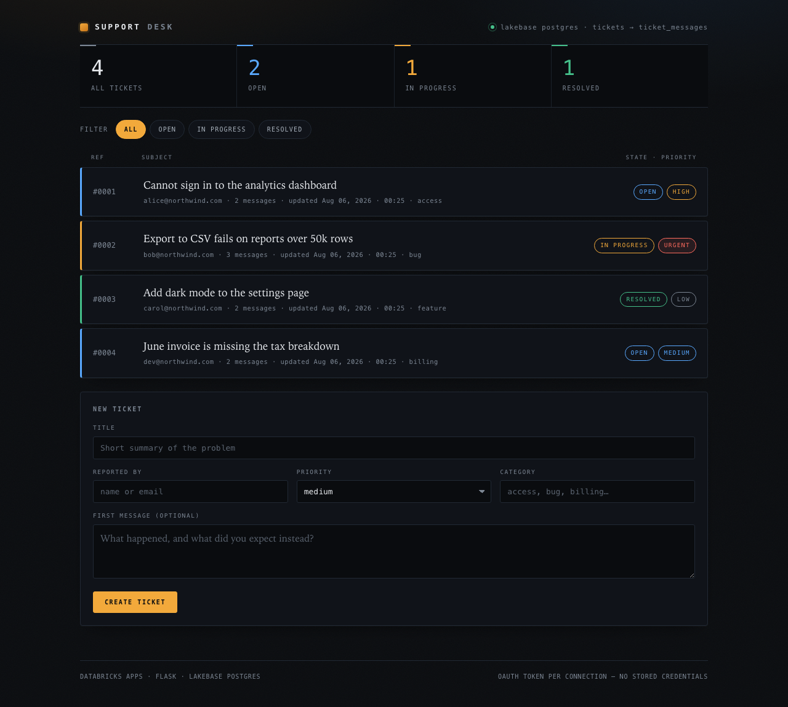
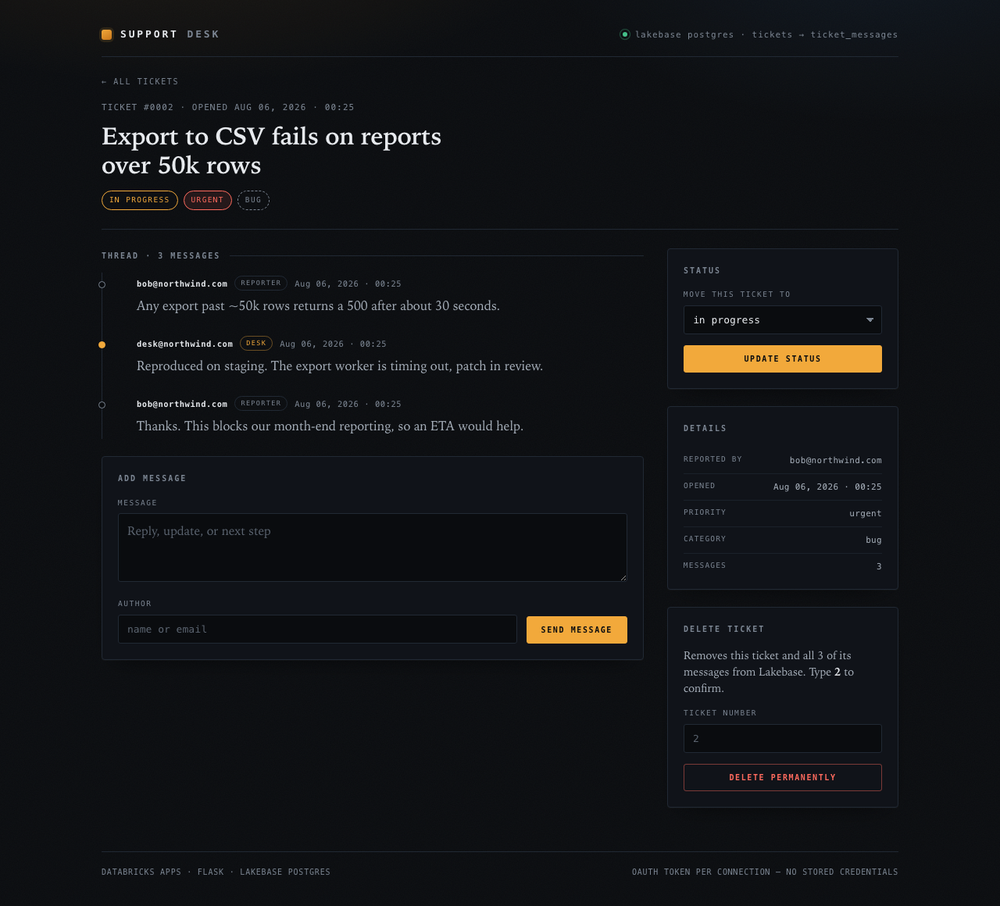

# Support Desk

An internal ticketing app running on **Databricks Apps**, with every row of
operational state in **Lakebase Postgres**. Flask, server-rendered HTML, one
stylesheet — no build step, no CDN, no stored credentials.

Built for the Databricks boot camp Day 1 assignment: two related tables, full
CRUD against an OLTP database, deployed and persistent.



## Data model

Two tables, one enforced foreign key. Deleting a ticket cascades to its thread.

```
tickets                             ticket_messages
─────────────────                   ────────────────────
ticket_id   PK                      message_id   PK
title                          ┌──  ticket_id    FK → tickets(ticket_id) ON DELETE CASCADE
status      open|in_progress   │    message_text
            |resolved          │    author
priority    low|medium         │    created_at
            |high|urgent       │
category                       │
created_by                     │
created_at                     │
     └─────────────────────────┘
```

`status` and `priority` are CHECK constraints, not application conventions —
the database rejects a bad value even if the app has a bug.

## What it does

| Requirement | Where |
|---|---|
| View all tickets | `/` — queue sorted by last activity, with per-status counts |
| View a ticket's messages | `/tickets/<id>` — threaded, reporter vs. desk |
| Create a ticket | form on `/`, with an optional opening message |
| Add a message | form on the ticket page |
| Update status | select + button on the ticket page |
| Reads and writes Lakebase | all SQL lives in `repository.py`; nothing hard-coded |

Beyond the brief: priority and category fields, status filtering, live status
counters, server-side validation with specific messages, delete behind a typed
ticket-number confirmation, a `/healthz` endpoint that proves database
reachability, and a designed UI.



## Authentication — no passwords anywhere

`db.py` defines a `psycopg.Connection` subclass whose `connect()` calls
`WorkspaceClient().postgres.generate_database_credential()` and uses the
returned OAuth token as the Postgres password. Every new pooled connection
mints its own; connections are recycled at 30 minutes so a token can never
expire mid-use.

The same code path authenticates as **your user identity** locally and as the
**app's service principal** once deployed — the only difference is `PGUSER`,
and when deployed the app falls back to the `DATABRICKS_CLIENT_ID` that
Databricks Apps injects, so there is nothing to fill in.

## Run it

Setup, deployment, and troubleshooting: **[RUNBOOK.md](RUNBOOK.md)**.

```bash
python3 smoke_test.py   # 18 offline checks over SQLite — no database needed
python3 init_db.py      # applies schema.sql, prints tickets + message counts
python3 app.py          # http://localhost:8000
curl $APP_URL/healthz   # {"status":"ok","database":"connected"}
```

## Layout

```
app.py           routes, validation, error pages, /healthz
repository.py    every SQL statement
db.py            lazy connection pool + OAuth token rotation
schema.sql       DDL, indexes, seed data (re-runnable)
grants.sql       Postgres role + privileges for the service principal
init_db.py       applies schema.sql, prints a verification table
smoke_test.py    18 offline route/validation checks, no Lakebase needed
app.yaml         Databricks Apps runtime config — no secrets
templates/       base, index, ticket, error
static/style.css one stylesheet, no web fonts, no CDN
```

There is no test suite beyond `smoke_test.py` and no CI. `.env` is gitignored
and never committed; `app.yaml` holds hostnames only.
